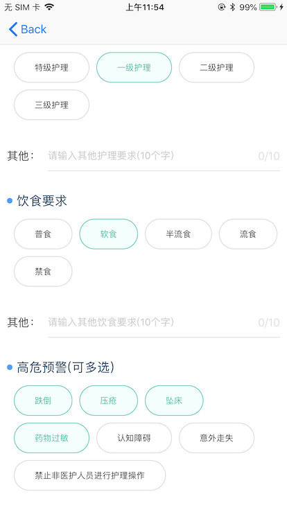

# RadioAndMutiSelect
单选和多选功能（swift）

# CBGroupAndStreamView
 //分组标志  默认"YouNoSet"
 public var groundTitle:String = "YouNoSet"
 

 @objc protocol CBGroupAndStreamViewDelegate : NSObjectProtocol {

    /// 传递所有选中的值 
    /// 必须调用 public func comfirm() 才触发
    /// - Parameters:
    ///   - selArr: 所有选中的值
    ///   - groupArr: gtoupIdArr

    @objc optional func confimrReturnAllSelValueWithDelegate(selArr : Array<Any>, groupArr : Array<Any>, groundTitle:String)

}

#Category.swift 常用的NSObject分类

 1.UIColor.ColorHex("")
 /**
  16进制转UIColor
  - parameter hex: 16进制颜色字符串
  - returns: 转换后的颜色
  */
  
 // MARK: - 主要逻辑
 
      class func ColorHex(_ hex: String) -> UIColor {
         return proceesHex(hex, alpha: 1.0)
      }
      private func proceesHex(_ hex: String, alpha: CGFloat) -> UIColor{
        
        /** 如果传入的字符串为空 */
        if hex.isEmpty {
            return UIColor.clear
        }

        /** 传进来的值。 去掉了可能包含的空格、特殊字符， 并且全部转换为大写 */

        let set = CharacterSet.whitespaces
        //var hHex = hex.stringByTrimmingCharactersInSet(set).uppercased()
        var hHex = hex.trimmingCharacters(in: set).uppercased()

        /** 如果处理过后的字符串少于6位 */
        if hHex.count < 6 {
            return UIColor.clear
        }

        /** 开头是用0x开始的 */
        if hHex.hasPrefix("0X") {
            hHex = (hHex as NSString).substring(from: 2)
        }
        /** 开头是以＃开头的 */
        if hHex.hasPrefix("#") {
            hHex = (hHex as NSString).substring(from: 1)
        }
        /** 开头是以＃＃开始的 */
        if hHex.hasPrefix("##") {
            hHex = (hHex as NSString).substring(from: 2)
        }

        /** 截取出来的有效长度是6位， 所以不是6位的直接返回 */
        if hHex.count != 6 {
            return UIColor.clear
        }

        /** R G B */
        var range = NSMakeRange(0, 2)

        /** R */
        let rHex = (hHex as NSString).substring(with: range)

        /** G */
        range.location = 2
        let gHex = (hHex as NSString).substring(with: range)

        /** B */
        range.location = 4
        let bHex = (hHex as NSString).substring(with: range)

        /** 类型转换 */
        var r:CUnsignedInt = 0, g:CUnsignedInt = 0, b:CUnsignedInt = 0;

        Scanner(string: rHex).scanHexInt32(&r)
        Scanner(string: gHex).scanHexInt32(&g)
        Scanner(string: bHex).scanHexInt32(&b)

        return UIColor(red: CGFloat(r) / 255.0, green: CGFloat(g) / 255.0, blue: CGFloat(b) / 255.0, alpha: alpha)
    }
